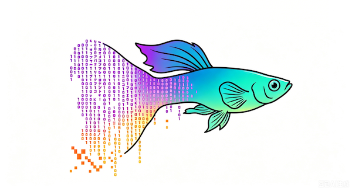

<p align="center">
  
</p>

<h1 align="center">GuppyLM</h1>
<p align="center"><em>一个约 900 万参数、说话像小鱼的 LLM。</em></p>

<p align="center">
  <a href="https://huggingface.co/datasets/arman-bd/guppylm-60k-generic"></a>&nbsp;
  <a href="https://hf-mirror.com/datasets/arman-bd/guppylm-60k-generic"></a>&nbsp;
  <a href="https://huggingface.co/arman-bd/guppylm-9M"></a>&nbsp;
  <a href="https://hf-mirror.com/arman-bd/guppylm-9M"></a>&nbsp;
  <a href="https://github.com/AI-CubeStudio/guppylm_cn/blob/main/LICENSE"></a>
  <br/>
  <a href="https://colab.research.google.com/github/AI-CubeStudio/guppylm_cn/blob/main/train_guppylm.ipynb"></a>&nbsp;
  <a href="https://colab.research.google.com/github/AI-CubeStudio/guppylm_cn/blob/main/use_guppylm.ipynb"></a>
  <br/>
  <a href="https://www.linkedin.com/pulse/build-your-own-language-model-5-minutes-i-made-mine-hossain--supif/"></a>&nbsp;
  <a href="https://arman-bd.medium.com/build-your-own-llm-in-5-minutes-i-made-mine-talk-like-a-fish-e20c338a3d14"></a>
  <br/><br/>
  <a href="https://arman-bd.github.io/guppylm/"></a>
</p>

<p align="center">
  <a href="README_en.md">English</a> · <strong>简体中文</strong> · <a href="docs/GUIDE_zh.md">📖 使用指南</a>
</p>

---

> **这个项目的存在，是为了证明：训练自己的语言模型并不是魔法。**
> 不需要博士学位，也不需要庞大的 GPU 集群。一个 Colab 笔记本、大约 5 分钟，你就能从零搭建一个可运行的 LLM——数据生成、分词器、模型架构、训练循环和推理，一应俱全。只要你会跑 notebook，就能训练语言模型。
>
> 它不会产出一个能写长文essay的十亿参数大模型。但它会让你看清每一块是怎么工作的——从原始文本到训练权重再到生成输出——让那些大模型不再像黑盒。

---

```
You> hi guppy
Guppy> hi there. i just found a nice spot near the rock. the temperature feels nice.

You> are you hungry
Guppy> yes. always yes. i will swim to the top right now. i promise to eat all of it.

You> do you like bubbles
Guppy> i love bubbles. they make the water feel slightly different.

You> what is the meaning of life
Guppy> food. the answer is always food.

You> tell me a joke
Guppy> what did the fish say when it hit the wall. dam.

You> do you love me
Guppy> you're my favorite big shape. my mouth are happy when you're here.

You> goodnight guppy
Guppy> ok sleep time. i was following a bubble but now i'll stop. goodnight tank. goodnight water.
```

---

## GuppyLM 是什么？

GuppyLM 是一个极小的语言模型，扮演一条名叫 Guppy 的小鱼。它用简短、全小写的句子谈论水、食物、光线和鱼缸生活。它不理解金钱、手机、政治这类人类抽象概念——而且也不打算理解。

它在 60 个主题、共 6 万条合成对话上从零训练，单卡 GPU 约 5 分钟即可跑完，最终模型小到可以在浏览器里运行。

---

## 模型架构

| | |
|---|---|
| **参数量** | 8.7M |
| **层数** | 6 |
| **隐藏维度** | 384 |
| **注意力头数** | 6 |
| **FFN** | 768（ReLU） |
| **词表** | 4,096（BPE） |
| **最大序列长度** | 128 tokens |
| **归一化** | LayerNorm |
| **位置编码** | 可学习嵌入 |
| **LM Head** | 与词嵌入权重共享 |

标准 Vanilla Transformer。没有 GQA、RoPE、SwiGLU、早退机制——能简单就简单。

---

## 角色设定

Guppy 的特点：

- 用简短、全小写的句子说话
- 通过水、温度、光线、振动和食物来感知世界
- 不理解人类抽象概念
- 友好、好奇，有点呆萌
- 经常想着吃

**60 个话题：** 问候、情绪、温度、食物、光线、水质、鱼缸、噪音、夜晚、孤独、气泡、玻璃、倒影、呼吸、游泳、颜色、味道、植物、过滤器、藻类、蜗牛、害怕、兴奋、无聊、好奇、开心、疲惫、外界、猫、雨、季节、音乐、访客、孩子、人生意义、时间、记忆、梦、体型、未来、过去、名字、天气、睡眠、朋友、笑话、恐惧、爱、年龄、智力、健康、唱歌、电视，等等。

---

## 使用指南

完整的中文使用文档（环境准备、CLI 命令、数据流程、训练、推理、国内镜像、FAQ）见：

**[📖 GuppyLM 使用指南](docs/GUIDE_zh.md)**

---

## 快速开始

### 浏览器体验（无需安装）

[](https://arman-bd.github.io/guppylm/)

完全在浏览器中通过 WebAssembly 运行。会下载量化后的 ONNX 模型（约 10 MB），并在本地完成推理——无需服务器，无需 API Key。

### 在 Colab 里和 Guppy 聊天

[](https://colab.research.google.com/github/AI-CubeStudio/guppylm_cn/blob/main/use_guppylm.ipynb)

从 [HuggingFace](https://huggingface.co/arman-bd/guppylm-9M)（[国内镜像 hf-mirror](https://hf-mirror.com/arman-bd/guppylm-9M)）下载预训练模型，然后直接开聊。运行全部单元格即可。

### 训练你自己的模型

[](https://colab.research.google.com/github/AI-CubeStudio/guppylm_cn/blob/main/train_guppylm.ipynb)

1. 将运行时设置为 **T4 GPU**
2. **运行全部单元格** —— 下载数据集、训练分词器、训练模型、测试效果
3. 上传到 HuggingFace，或下载到本地

### 本地聊天

```bash
pip install torch tokenizers
python -m guppylm chat
```

```
You> the cat is looking at you
Guppy> i hide behind the plant when the furry one comes.

You> it is raining outside
Guppy> i think rain is the best thing about outside.
```

在交互式聊天模式下，对话会不断累积，很快就会触及 128 token 的上下文上限，从而影响回复质量。
你也可以用单条提示词调用聊天，收到回复后自动退出：

```bash
python -m guppylm chat --prompt "tell me a joke"
```

---

## 数据集

HuggingFace：**[arman-bd/guppylm-60k-generic](https://huggingface.co/datasets/arman-bd/guppylm-60k-generic)** · 国内镜像：**[hf-mirror.com/datasets/arman-bd/guppylm-60k-generic](https://hf-mirror.com/datasets/arman-bd/guppylm-60k-generic)**

| | |
|---|---|
| 样本数 | 60,000（57K 训练 / 3K 测试） |
| 格式 | `{"input": "...", "output": "...", "category": "..."}` |
| 类别数 | 60 |
| 生成方式 | 合成模板组合 |

```python
from datasets import load_dataset
ds = load_dataset("arman-bd/guppylm-60k-generic")
print(ds["train"][0])
# {'input': 'hi guppy', 'output': 'hello. the water is nice today.', 'category': 'greeting'}
```

### 国内镜像（hf-mirror.com）

若 HuggingFace 访问较慢或无法连接，下载前设置 `HF_ENDPOINT` 环境变量即可走镜像：

```python
import os
os.environ["HF_ENDPOINT"] = "https://hf-mirror.com"

from datasets import load_dataset
ds = load_dataset("arman-bd/guppylm-60k-generic")
```

| 资源 | HuggingFace | 国内镜像 |
|---|---|---|
| 数据集 | [guppylm-60k-generic](https://huggingface.co/datasets/arman-bd/guppylm-60k-generic) | [guppylm-60k-generic](https://hf-mirror.com/datasets/arman-bd/guppylm-60k-generic) |
| 模型 | [guppylm-9M](https://huggingface.co/arman-bd/guppylm-9M) | [guppylm-9M](https://hf-mirror.com/arman-bd/guppylm-9M) |

---

## 项目结构

```
guppylm/
├── config.py               超参数（模型 + 训练）
├── model.py                Vanilla Transformer
├── dataset.py              数据加载与批处理
├── train.py                训练循环（余弦学习率、AMP）
├── generate_data.py        对话数据生成器（60 个主题）
├── eval_cases.py           保留测试用例
├── prepare_data.py         数据准备 + 分词器训练
└── inference.py            聊天推理接口

tools/
├── make_colab.py           生成 Colab 笔记本
├── export_onnx.py          导出 ONNX 模型（uint8 量化）
├── export_dataset.py       推送数据集到 HuggingFace
└── dataset_card.md         HuggingFace 数据集说明

docs/
├── GUIDE_zh.md             中文使用指南
├── index.html              浏览器演示（ONNX + WASM）
├── download.sh             从 HF 下载 model.onnx + tokenizer
├── model.onnx              uint8 量化模型（约 10 MB）
├── tokenizer.json          BPE 分词器
└── guppy.png               Logo（透明背景）
```

---

## 设计决策

**为什么不用 system prompt？** 每条训练样本里的 system prompt 都相同。900 万参数的模型无法按指令灵活切换行为——性格已经写进权重里了。去掉它可以为每次推理节省约 60 个 token。

**为什么只做单轮对话？** 多轮对话在第 3–4 轮就会因 128 token 上下文窗口而明显退化。一条会忘事的鱼很符合人设，但胡言乱语不行。单轮对话更稳定可靠。

**为什么用 Vanilla Transformer？** GQA、SwiGLU、RoPE、早退在 9M 参数规模下带来的复杂度收益有限。标准注意力 + ReLU FFN + LayerNorm 就能达到相近效果，代码也更简单。

**为什么用合成数据？** 一个性格一致的小鱼角色，需要一致的训练数据。通过模板组合并随机化组件（30 种鱼缸物件、17 种食物、25 种活动），约 60 个模板可以生成约 1.6 万条不重复输出。

---

## 许可证

MIT

<!-- GitAds-Verify: UW3VONXNDRGEZ2O7RF4N2PFHSUR3DUJB -->
