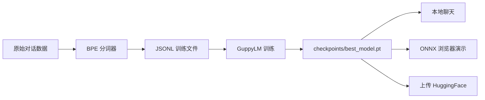
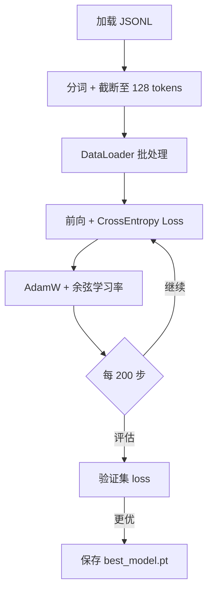

# GuppyLM 使用指南

> 本文基于项目源码梳理，覆盖从零体验、本地训练到模型发布的完整流程。  
> 英文 README：[README_en.md](../README_en.md) · 中文简介：[README.md](../README.md)

---

## 目录

1. [项目是什么](#1-项目是什么)
2. [环境准备](#2-环境准备)
3. [四条使用路径](#3-四条使用路径)
4. [CLI 命令详解](#4-cli-命令详解)
5. [数据流程](#5-数据流程)
6. [训练流程](#6-训练流程)
7. [推理与聊天](#7-推理与聊天)
8. [导出与发布](#8-导出与发布)
9. [国内镜像（hf-mirror）](#9-国内镜像hf-mirror)
10. [项目结构速查](#10-项目结构速查)
11. [常见问题](#11-常见问题)
12. [进阶定制](#12-进阶定制)

---

## 1. 项目是什么

GuppyLM 是一个约 **870 万参数** 的微型语言模型，从零训练，扮演一条名叫 Guppy 的小鱼。

| 维度 | 说明 |
|------|------|
| 定位 | 教学/演示：展示 LLM 全链路（数据 → 分词器 → 模型 → 训练 → 推理） |
| 训练数据 | 6 万条单轮合成对话，60 个话题 |
| 训练耗时 | 单卡 T4 GPU 约 5 分钟 |
| 推理规模 | 可导出为 ~10 MB ONNX，在浏览器本地运行 |

### 整体数据流



---

## 2. 环境准备

### 2.1 依赖安装

```bash
# 克隆本仓库
git clone https://github.com/AI-CubeStudio/guppylm_cn.git
cd guppylm_cn

# 安装核心依赖
pip install -r requirements.txt
```

`requirements.txt` 包含：

| 包 | 用途 |
|----|------|
| `torch` | 模型训练与推理 |
| `tokenizers` | BPE 分词器 |
| `datasets` | 从 HuggingFace 下载数据集 |
| `tqdm` / `numpy` | 辅助工具 |

### 2.2 硬件建议

| 场景 | 建议 |
|------|------|
| 仅聊天（下载预训练模型） | CPU 即可 |
| 本地训练 | CUDA GPU（推荐）/ Apple MPS / CPU（较慢） |
| Colab 训练 | T4 GPU |

### 2.3 发布到 HuggingFace（可选）

复制环境变量模板：

```bash
cp .env.example .env
```

编辑 `.env`：

```env
HF_TOKEN=hf_你的令牌
HF_REPO=你的用户名/guppylm-9M
HF_DATASET=你的用户名/guppylm-60k-generic
```

---

## 3. 四条使用路径

根据你的目标选择入口：

| 路径 | 适合人群 | 入口 | 是否需要 GPU |
|------|----------|------|--------------|
| **A. 浏览器体验** | 零安装快速试用 | [浏览器演示](https://arman-bd.github.io/guppylm/) | 否 |
| **B. Colab 聊天** | 想聊预训练模型 | [use_guppylm.ipynb](../use_guppylm.ipynb) | 否（Colab 提供） |
| **C. Colab 训练** | 想完整走一遍训练 | [train_guppylm.ipynb](../train_guppylm.ipynb) | 是（T4） |
| **D. 本地 CLI** | 开发者本地调试 | `python -m guppylm` | 训练时需要 |

### 路径 A：浏览器体验

1. 打开 https://arman-bd.github.io/guppylm/
2. 页面自动下载量化 ONNX 模型（约 10 MB）和分词器
3. 在网页中直接对话，全程本地推理，无需 API Key

本地搭建浏览器演示：

```bash
# 下载 ONNX 与分词器到 docs/
bash docs/download.sh

# 启动静态服务（按项目实际 web 目录调整）
cd docs && python -m http.server 8080
```

### 路径 B：Colab 聊天

1. 打开 [use_guppylm.ipynb](https://colab.research.google.com/github/AI-CubeStudio/guppylm_cn/blob/main/use_guppylm.ipynb)
2. 运行全部单元格
3. 自动从 HuggingFace 下载 `arman-bd/guppylm-9M` 并开始交互

### 路径 C：Colab 训练（推荐入门）

1. 打开 [train_guppylm.ipynb](https://colab.research.google.com/github/AI-CubeStudio/guppylm_cn/blob/main/train_guppylm.ipynb)
2. 运行时选择 **T4 GPU**
3. 依次完成：下载数据集 → 训练分词器 → 训练模型 → 测试对话 →（可选）上传 HuggingFace

### 路径 D：本地 CLI 完整流程

```bash
# 1. 准备数据 + 训练分词器（本地合成 6 万条）
python -m guppylm prepare

# 2. 训练模型（约 10000 步）
python -m guppylm train

# 3. 与 Guppy 聊天
python -m guppylm chat
```

若只想聊天、不自己训练：

```bash
pip install torch tokenizers
python -m guppylm download   # 下载预训练权重
python -m guppylm chat
```

---

## 4. CLI 命令详解

入口文件：`guppylm/__main__.py`

```bash
python -m guppylm              # 显示帮助
python -m guppylm prepare      # 生成数据 + 训练分词器
python -m guppylm train        # 训练模型
python -m guppylm download     # 从 HuggingFace 下载预训练模型
python -m guppylm chat         # 交互式聊天
```

### `prepare` — 数据与分词器

调用 `guppylm/prepare_data.py`，执行：

1. `generate_data.generate_dataset(60000)` — 生成 6 万条合成对话
2. 写入 `data/train.jsonl`、`data/eval.jsonl`
3. 在全部文本上训练 BPE 分词器（词表 4096）
4. 保存到 `data/tokenizer.json`

### `train` — 模型训练

调用 `guppylm/train.py`，读取：

- 训练集：`data/train.jsonl`
- 验证集：`data/eval.jsonl`
- 分词器：`data/tokenizer.json`

输出目录 `checkpoints/`：

| 文件 | 说明 |
|------|------|
| `best_model.pt` | 验证集 loss 最优的检查点（聊天默认使用） |
| `final_model.pt` | 训练结束时的最终权重 |
| `step_500.pt` 等 | 每 500 步的中间检查点 |
| `config.json` | 模型与训练超参数 |

### `download` — 下载预训练模型

从 `arman-bd/guppylm-9M` 下载：

| 远程文件 | 本地路径 |
|----------|----------|
| `pytorch_model.bin` | `checkpoints/best_model.pt` |
| `tokenizer.json` | `data/tokenizer.json` |
| `config.json` | `checkpoints/config.json` |

> 注意：国内用户若下载失败，可手动从 [hf-mirror](https://hf-mirror.com/arman-bd/guppylm-9M) 下载同名文件放到对应路径。

### `chat` — 聊天推理

```bash
# 交互模式（多轮，会累积上下文）
python -m guppylm chat

# 单轮模式（推荐，避免超出 128 token 上限）
python -m guppylm chat --prompt "tell me a joke"

# 指定检查点与设备
python -m guppylm chat \
  --checkpoint checkpoints/best_model.pt \
  --tokenizer data/tokenizer.json \
  --device cuda
```

输入 `quit` / `exit` / `q` 退出交互模式。

---

## 5. 数据流程

### 5.1 数据来源（二选一）

**方式一：本地合成（`prepare` 默认）**

`guppylm/generate_data.py` 通过 60 个话题生成器 + 模板随机组合，产出高多样性对话。

**方式二：从 HuggingFace 下载**

数据集：[arman-bd/guppylm-60k-generic](https://huggingface.co/datasets/arman-bd/guppylm-60k-generic)  
国内镜像：[hf-mirror 数据集页](https://hf-mirror.com/datasets/arman-bd/guppylm-60k-generic)

```bash
python datasetDownload.py   # 仅下载到 HF 缓存
```

下载后需转换为训练格式（参考 `train_guppylm.ipynb`）：

```python
import json, os
import os
os.environ["HF_ENDPOINT"] = "https://hf-mirror.com"  # 国内用户

from datasets import load_dataset

ds = load_dataset("arman-bd/guppylm-60k-generic")
os.makedirs("data", exist_ok=True)

for split, path in [("train", "data/train.jsonl"), ("test", "data/eval.jsonl")]:
    with open(path, "w") as f:
        for row in ds[split]:
            text = (
                f'<|im_start|>user\n{row["input"]}<|im_end|>\n'
                f'<|im_start|>assistant\n{row["output"]}<|im_end|>'
            )
            f.write(json.dumps({"text": text, "category": row["category"]}) + "\n")
```

然后单独训练分词器，或直接运行 `python -m guppylm prepare` 中的分词器逻辑。

### 5.2 数据格式说明

**HuggingFace 原始格式：**

```json
{"input": "hi guppy", "output": "hello. the water is nice today.", "category": "greeting"}
```

**本地训练 JSONL 格式（每行一条）：**

```json
{"text": "<|im_start|>user\nhi guppy<|im_end|>\n<|im_start|>assistant\nhello...<|im_end|>", "category": "greeting"}
```

**特殊 Token：**

| Token | ID | 用途 |
|-------|-----|------|
| `<pad>` | 0 | 填充 |
| `<\|im_start\|>` | 1 | 角色段起始 |
| `<\|redacted_im_end\|>` | 2 | 角色段结束 |

### 5.3 生成后的文件

```
data/
├── train.jsonl          # 训练集（约 57K）
├── eval.jsonl           # 验证集（约 3K）
├── train_openai.jsonl   # OpenAI messages 格式（备用）
├── eval_openai.jsonl
└── tokenizer.json       # BPE 分词器（prepare 后生成）
```

---

## 6. 训练流程

### 6.1 默认超参数

定义于 `guppylm/config.py`：

**模型（GuppyConfig）**

| 参数 | 默认值 |
|------|--------|
| vocab_size | 4096 |
| max_seq_len | 128 |
| d_model | 384 |
| n_layers | 6 |
| n_heads | 6 |
| ffn_hidden | 768 |
| dropout | 0.1 |

**训练（TrainConfig）**

| 参数 | 默认值 |
|------|--------|
| batch_size | 32 |
| learning_rate | 3e-4 |
| max_steps | 10000 |
| warmup_steps | 200 |
| eval_interval | 200 |
| save_interval | 500 |
| data_dir | `data` |
| output_dir | `checkpoints` |

### 6.2 训练过程



训练特性：

- 优化器：AdamW（weight_decay=0.1）
- 学习率：warmup + cosine 衰减
- CUDA 下自动启用 AMP 混合精度
- 设备自动选择：CUDA → MPS → CPU

### 6.3 修改超参数

直接编辑 `guppylm/config.py` 中的 dataclass 默认值，或在 Colab notebook 中修改同名配置后重新运行训练单元格。

### 6.4 训练日志示例

```
     Step |         LR |      Train |       Eval |     Time
--------------------------------------------------------
    200 |   0.000300 |     2.8451 |     2.7123 |    45.2s
  -> Best model (eval=2.7123)
```

---

## 7. 推理与聊天

### 7.1 推理 API

核心类：`guppylm/inference.py` 中的 `GuppyInference`

```python
from guppylm.inference import GuppyInference

engine = GuppyInference(
    checkpoint_path="checkpoints/best_model.pt",
    tokenizer_path="data/tokenizer.json",
    device="cpu",  # 或 "cuda" / "mps"
)

result = engine.chat_completion(
    messages=[{"role": "user", "content": "hi guppy"}],
    temperature=0.7,
    max_tokens=64,
    top_k=50,
)

print(result["choices"][0]["message"]["content"])
```

### 7.2 Prompt 格式

单轮对话会被格式化为 ChatML 风格：

```
<|im_start|>user
hi guppy<|im_end|>
<|im_start|>assistant
```

模型从 `assistant` 段开始生成，遇到 `<|im_end|>` 自动截断。

### 7.3 使用注意

| 注意点 | 说明 |
|--------|------|
| **单轮优先** | 上下文上限 128 token，多轮对话会快速劣化 |
| **无 system prompt** | 性格已写入权重，不需要额外系统提示 |
| **小写风格** | 训练数据全小写，输出也偏短句小写 |
| **温度采样** | 默认 temperature=0.7、top_k=50 |

### 7.4 评估用例

`guppylm/eval_cases.py` 包含手工编写的测试用例，用于检查关键词与风格一致性，可在 notebook 或自定义脚本中调用。

---

## 8. 导出与发布

### 8.1 导出 ONNX（浏览器演示）

```bash
python tools/export_onnx.py                        # 默认 uint8 量化
python tools/export_onnx.py --no-quantize          # 保留 float32
python tools/export_onnx.py --push                 # 同时上传到 HF
```

输出：`docs/model.onnx`（约 10 MB）+ 分词器副本。

### 8.2 导出并推送模型到 HuggingFace

```bash
python tools/export_model.py \
  --checkpoint checkpoints/best_model.pt \
  --tokenizer data/tokenizer.json \
  --repo your-username/guppylm-9M \
  --token hf_xxx
```

生成标准 HF 布局：

```
hf_export/
├── pytorch_model.bin
├── config.json
├── tokenizer.json
└── README.md
```

### 8.3 推送数据集到 HuggingFace

```bash
python tools/export_dataset.py \
  --repo your-username/guppylm-60k-generic \
  --token hf_xxx
```

### 8.4 重新生成 Colab 笔记本

```bash
make notebook
# 等价于：python3 tools/make_colab.py
```

从源码重新生成 `train_guppylm.ipynb` 与 `use_guppylm.ipynb`。

---

## 9. 国内镜像（hf-mirror）

| 资源 | HuggingFace | 国内镜像 |
|------|-------------|----------|
| 数据集 | [guppylm-60k-generic](https://huggingface.co/datasets/arman-bd/guppylm-60k-generic) | [镜像链接](https://hf-mirror.com/datasets/arman-bd/guppylm-60k-generic) |
| 模型 | [guppylm-9M](https://huggingface.co/arman-bd/guppylm-9M) | [镜像链接](https://hf-mirror.com/arman-bd/guppylm-9M) |

**Python 下载走镜像：**

```python
import os
os.environ["HF_ENDPOINT"] = "https://hf-mirror.com"

from datasets import load_dataset
ds = load_dataset("arman-bd/guppylm-60k-generic")
```

**命令行下载模型文件（示例）：**

```bash
# 将 huggingface.co 替换为 hf-mirror.com
curl -L "https://hf-mirror.com/arman-bd/guppylm-9M/resolve/main/pytorch_model.bin" \
  -o checkpoints/best_model.pt
```

---

## 10. 项目结构速查

```
guppylm/
├── __main__.py          # CLI 入口（prepare/train/chat/download）
├── config.py            # 模型与训练超参数
├── model.py             # Vanilla Transformer + generate()
├── dataset.py           # GuppyDataset + DataLoader
├── train.py             # 训练循环
├── inference.py         # GuppyInference 聊天接口
├── prepare_data.py      # 数据准备 + 分词器训练
├── generate_data.py     # 60 话题合成数据生成器
└── eval_cases.py        # 手工评估用例

tools/
├── export_onnx.py       # ONNX 导出（浏览器）
├── export_model.py      # HF 模型发布
├── export_dataset.py    # HF 数据集发布
└── make_colab.py        # 生成 Colab 笔记本

docs/
├── GUIDE_zh.md          # 本指南
├── index.html           # 浏览器演示页
└── download.sh          # 下载 ONNX 资源

datasetDownload.py       # HF 数据集下载脚本（含镜像配置）
train_guppylm.ipynb      # Colab 完整训练流程
use_guppylm.ipynb        # Colab 聊天流程
```

---

## 11. 常见问题

### Q1：`python -m guppylm chat` 提示 Model not found

先执行：

```bash
python -m guppylm download
```

或自行训练：`prepare` → `train`。

### Q2：聊天回复越来越乱

128 token 上下文有限，交互模式会累积历史。**改用单轮模式**：

```bash
python -m guppylm chat --prompt "你的问题"
```

### Q3：HuggingFace 下载超时

设置镜像环境变量（见第 9 节），或浏览器打开镜像站手动下载文件。

### Q4：训练很慢 / 没用到 GPU

确认 PyTorch 能识别 GPU：

```python
import torch
print(torch.cuda.is_available())  # NVIDIA
print(torch.backends.mps.is_available())  # Apple Silicon
```

`TrainConfig.device` 默认为 `"auto"`，会依次尝试 CUDA → MPS → CPU。

### Q5：`prepare` 和 HF 数据集有什么区别？

| | `prepare`（本地生成） | HF 数据集 |
|--|----------------------|-----------|
| 数据量 | 6 万条 | 6 万条（官方同款） |
| 随机种子 | 固定 seed=42 | 官方固定版本 |
| 分词器 | 自动训练 | 需自行训练或复用 |
| 网络 | 不需要 | 需要下载 |

两者训练出的模型风格一致，教学场景任选其一即可。

### Q6：能否改成中文 Guppy？

可以，但需要：**中文训练数据 → 重训分词器 → 重训模型**。当前词表与数据均为英文小鱼人设。

---

## 12. 进阶定制

### 调整数据量

编辑 `guppylm/prepare_data.py`：

```python
prepare(n_samples=10000, eval_ratio=0.05)  # 快速实验
```

### 调整模型大小

修改 `guppylm/config.py` 中 `GuppyConfig` 的 `d_model`、`n_layers` 等，注意参数量与训练时间会显著变化。

### 新增对话话题

在 `guppylm/generate_data.py` 中：

1. 编写 `gen_xxx()` 生成函数，返回 `{"input": ..., "output": ..., "category": ...}`
2. 将函数加入 `generate_dataset()` 的 `topics` 列表

### 在代码中集成推理

```python
from guppylm.inference import GuppyInference

class FishBot:
    def __init__(self):
        self.engine = GuppyInference(
            "checkpoints/best_model.pt",
            "data/tokenizer.json",
            device="cpu",
        )

    def reply(self, user_text: str) -> str:
        r = self.engine.chat_completion([{"role": "user", "content": user_text}])
        return r["choices"][0]["message"]["content"]
```

---

## 快速命令备忘

```bash
# ── 零门槛体验 ──
# 浏览器：https://arman-bd.github.io/guppylm/

# ── 本地聊天（预训练模型）──
pip install torch tokenizers
python -m guppylm download
python -m guppylm chat --prompt "hi guppy"

# ── 本地完整训练 ──
pip install -r requirements.txt
python -m guppylm prepare
python -m guppylm train
python -m guppylm chat

# ── 国内下载数据集 ──
python datasetDownload.py

# ── 导出浏览器模型 ──
python tools/export_onnx.py
```

---

*最后更新：与仓库 main 分支源码同步梳理。*
